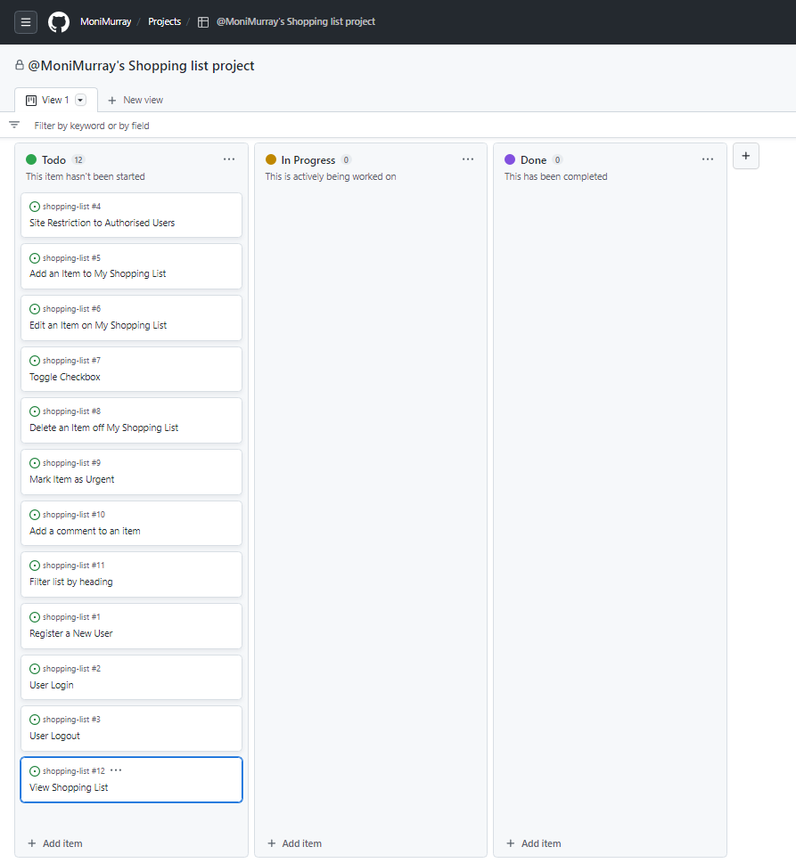
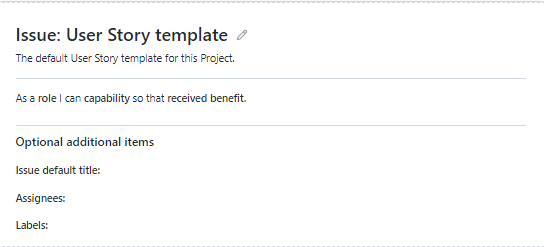
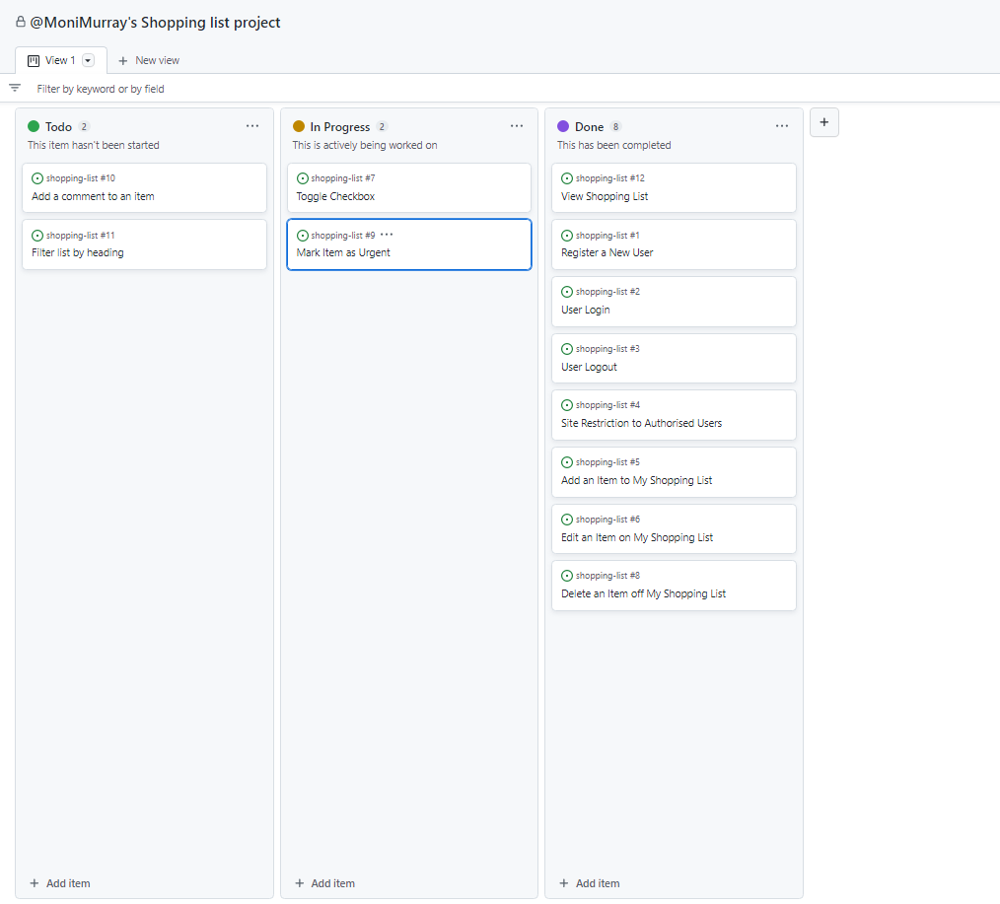

**Agile Methodology**

I have used GitHub Projects to plan the Agile development of my project.  I created a new project in the Projects tab of my repository, named ['@MoniMurray's Shopping List Project'](https://github.com/users/MoniMurray/projects/6).  Within this Project I used a Kanban Board to track each User Story as I incrementally developed the MVP of the project.  

This is a screenshot of the Kanban board in Projects.
 

- User Stories

A user story is a small, self-contained unit of development.  I have used these units in my Project to incrementally achieve the MVP.  Each user story is based on a bespoke user story Template which is created in the Settings tab of my GitHub repository.

Each User Story extends from the Template and is created in the Issues tab of my Github repository.  

User Stories have been grouped and categorised into Epics using bespoke 'labels', where appropriate, and then assigned to the project named '@MoniMurray's Shopping List Project' where they are used to structure the development of the MVP of my project.

    - **Problem Statement**

    - How do I develop a List application that provides all this functionality to a user?

| Features/Functionality                                                      | Problem Statement                                                                   | User Story                                                                                                      |
| --------------------------------------------------------------------------- | ----------------------------------------------------------------------------------- | --------------------------------------------------------------------------------------------------------------- |
|                                                                             | How do I develop a List application that provides all this functionality to a user? | As a (role) I can (capability) so that (received benefit).                                                      |
|                                                                             |                                                                                     |                                                                                                                 |
| REGISTRATION - Authorisation/Authentication - Epic                          |                                                                                     |                                                                                                                 |
|                                                                             |                                                                                     |                                                                                                                 |
| Registration                                                                |                                                                                     | As a new user I can register to the List App so that I can access all the application's functionality securely. |
| Login                                                                       |                                                                                     | As a registered user I can Login with username and password.                                                    |
| Logout                                                                      |                                                                                     | As a logged-in user I can Logout of the app when finished using the list.                                       |
|                                                                             |                                                                                     |                                                                                                                 |
| CRUD                                                                        |                                                                                     |                                                                                                                 |
| Read                                                                        |                                                                                     | As an unregistered user, I can only see the updated list on the Home page.                                      |
| Add Item to List                                                            |                                                                                     | As a logged in user I can click Add so that I can add an item to my List                                        |
| Edit existing Item on List                                                  |                                                                                     | As a logged in user I can click Edit so that I can edit the detail of an item on my List                        |
| Toggle/Tick list item as complete                                           |                                                                                     | As a logged in user I can tick the checkbox of an item so that I can mark the item as done.                     |
| Delete list item                                                            |                                                                                     | As a logged in user I can delete an item so that I can remove it from the list.                                 |
| Mark an item on the List as urgent                                          |                                                                                     | As a logged in user I can tick a star icon so that the item is marked Urgent.                                   |
|                                                                             |                                                                                     |                                                                                                                 |
| COMMENTING                                                                  |                                                                                     |                                                                                                                 |
| Add a comment to an item, re bulb wattage, specific shop, size of item etc. |                                                                                     | As a logged in user I can add a comment to an item so that that item has more detail                            |
|                                                                             |                                                                                     |                                                                                                                 |
| FILTERING                                                                   |                                                                                     |                                                                                                                 |
| Filter view                                                                 |                                                                                     | As a logged in user I can filter my shopping list by category so that I know where to shop.                     |
| View Shopping List                                                          |                                                                                     | As a user I can view the shopping list.                                                                         |
| MESSAGING                                                                   |                                                                                     |                                                                                                                 |
| Feedback to User on all feedback - Success/Error                            |                                                                                     | As I user I can see response messages to each action so that I know if they have been successful or not         |

- User Acceptance Criteria

I created a set of Acceptance Criteria for each User Story to set out a clear objective of what to achieve to complete each story.  The objective is broken down into steps, and in that way is a clear and measurable way of confirming the work is complete:

| User Story                                                                                                      | Acceptance Criteria                                                                                                                                                                                                                                                                                                                                                                                                                                                            |
| --------------------------------------------------------------------------------------------------------------- | ------------------------------------------------------------------------------------------------------------------------------------------------------------------------------------------------------------------------------------------------------------------------------------------------------------------------------------------------------------------------------------------------------------------------------------------------------------------------------ |
| As a new user I can register to the List App so that I can access all the application's functionality securely. | \- I can click on Register link on Nav bar to launch the Registration form; \- I can enter a username and password in the fields provided; \- I am prompted to complete fields; \- I can click on 'Register' button; \- I see a confirmation message that Registration is successful.                                                                                                                                                                              |
| As a registered user I can Login with username and password.                                                    | \- I can click on Login link on Nav bar to launch the Login form; \- I can enter my registered username and password; \- I am prompted to complete fields; \- I can click on Login button; \- I can see a success 'welcome' login message; \- I am redirected to the Home page where my expanded view of the full functionality of the shopping list, with clickable icons; \- On the navigation bar I can now see Logout instead of 'Register' and 'Login'. |
| As a logged-in user I can Logout of the app when finished using the list.                                       | \- I can click on 'Logout' link on Nav bar to launch a confirmation message; \- I can confirm I want to logout; \- I can see a confirmation message of successful logout; \- I can be returned to the Home page automatically on logout; \- On the navigation bar I can see 'Register' and 'Login'.                                                                                                                                                                |
| As an unregistered user, I can only see the updated list on the Home page.                                      | \- I can read only the shopping list entry names on the home page; \- I can see paragraph inviting me to 'Register' or 'Login' to edit or delete from the list;                                                                                                                                                                                                                                                                                                             |
| As a logged in user I can click Add so that I can add an item to my List                                        | \- I can click on '+' icon to launch the Add Item form; \- I can complete all fields on the form; \- I am prompted to complete empty fields; \- name the new item; \- quantity drop-down; \- category drop-down - food, household, pet etc. - filter by this; \- I can click 'Submit' and be returned to Home page.                                                                                                                                          |
| As a logged in user I can click Edit so that I can edit the detail of an item on my List                        | \- I can click on pencil edit icon beside any shopping list entry to open the entry; \- I can edit any field of the entry; \- I can save to return to Home page and full shopping list view; \- I can see my successful.                                                                                                                                                                                                                                              |
| As a logged in user I can tick the checkbox of an item so that I can mark the item as done.                     | \- I can click on the checkbox beside any shopping list entry; \- An empty checkbox will add a tick, the entry text will appear with a line through the text; \- A ticked checkbox will toggle the box to empty and the text will appear as normal.                                                                                                                                                                                                                      |
| As a logged in user I can delete an item so that I can remove it from the list.                                 | \- I can click on the delete icon beside any shopping list entry; \- I will see a message asking to confirm I want to delete the named entry, which I must click to confirm; \- I can see a confirmation message "entry" has been deleted.                                                                                                                                                                                                                               |
| As a logged in user I can tick a star icon so that the item is marked Urgent.                                   | \- I can click on the 'star' icon beside an Item; \- The icon will be solid if urgent, outline only if not urgent.                                                                                                                                                                                                                                                                                                                                                          |
| As a logged in user I can add a comment to an item so that that item has more detail                            | \- I can click on the list item to open the Item; \- I can click on Comment body field; \- I can Add a comment; \- I can 'Submit' to Save my comments and return to Home page.                                                                                                                                                                                                                                                                                        |
| As a logged in user I can filter my shopping list by category so that I know where to shop.                     |                                                                                                                                                                                                                                                                                                                                                                                                                                                                                |
| As a user I can view the shopping list.                                                                         | \- On the landing page I can see the shopping list; \- If I am registered/logged in, I can see the expanded view shopping list; \- If a new item is added to the shopping list I can see it on the list.                                                                                                                                                                                                                                                                 |

- Prioritisation of User Stories

I have used MoSCoW Prioritisation to assign a priority level to the User Stories of the Project.  'MoSCoW' is an acronym for 'Must have', 'Should have', 'Could have, 'Will not have' and represent the prioritisation level applied to User Stories during this iteration of production.  For the purpose of this project, 'an iteration' represents this project's lifecycle up to submission.

1.  Must Have - these User Stories are non-negotiable and represent the core functionality of the Project - those being the Responsive front-end design, User Registration and Authentication, and CRUD.  This represents approximately 60% of the effort planned for the project overall.
2.  Should Have and Could Have - Should have/Could have can be grouped together as being important aspects of the Project adding significant value, but as they are not vital they should each represent approximately 20% of the effort planned for the project.
3. Won't Have - User Stories marked as Won't have may be included as features in future iterations of my Project, but will not be delivered in this iteration.

| User Story                                                                                                      | MOSCOW      |
| --------------------------------------------------------------------------------------------------------------- | ----------- |
| As a new user I can register to the List App so that I can access all the application's functionality securely. | Must Have   |
| As a registered user I can Login with username and password.                                                    | Must Have   |
| As a logged-in user I can Logout of the app when finished using the list.                                       | Must Have   |
| As an unregistered user, I can only see the updated list on the Home page.                                      | Must Have   |
| As a logged in user I can click Add so that I can add an item to my List                                        | Must Have   |
| As a logged in user I can click Edit so that I can edit the detail of an item on my List                        | Must Have   |
| As a logged in user I can tick the checkbox of an item so that I can mark the item as done.                     | Should Have |
| As a logged in user I can delete an item so that I can remove it from the list.                                 | Must Have   |
| As a logged in user I can tick a star icon so that the item is marked Urgent.                                   | Could have  |
| As a logged in user I can add a comment to an item so that that item has more detail                            | Could have  |
| As a logged in user I can filter my shopping list by category so that I know where to shop.                     | Should have |
| As a user I can view the shopping list.                                                                         | Must have   |
| As I user I can see response messages to each action so that I know if they have been successful or not         | Should have |

- User Story Tasks

I have used the acceptance criteria steps to create tasks to facilitate the execution of each User Story.  Once these tasks for each User Story are complete and tested, the User Story is finished and is assigned as 'Done' in the Project Kanban.

| Acceptance Criteria                                                                                                                                                                                                                                                                                                                                                                                                                                                            | User Story Task                                                                                                                                                                                                                                                                                                                                                                                                                                                                                                                                                    |
| ------------------------------------------------------------------------------------------------------------------------------------------------------------------------------------------------------------------------------------------------------------------------------------------------------------------------------------------------------------------------------------------------------------------------------------------------------------------------------ | ------------------------------------------------------------------------------------------------------------------------------------------------------------------------------------------------------------------------------------------------------------------------------------------------------------------------------------------------------------------------------------------------------------------------------------------------------------------------------------------------------------------------------------------------------------------ |
| \- I can click on Register link on Nav bar to launch the Registration form; \- I can enter a username and password in the fields provided; \- I am prompted to complete fields; \- I can click on 'Register' button; \- I see a confirmation message that Registration is successful.                                                                                                                                                                              | 1\. Extend base.html to add allauth registration form, 2\. Include  in form template for security, 3\. Launch Registration form when user click's 'Register' link, 4\. Launch Registration form when user click's on 'Register' link in the paragraph on Shopping List body, 5\. Username, password and repeat password are required fields, 6\. flash screen message "Welcome {{username}}", 7\. User returned to Home page (url '/') where expanded list function is displayed ie. add, edit, delete, star, toggle checkbox.  |
| \- I can click on Login link on Nav bar to launch the Login form; \- I can enter my registered username and password; \- I am prompted to complete fields; \- I can click on Login button; \- I can see a success 'welcome' login message; \- I am redirected to the Home page where my expanded view of the full functionality of the shopping list, with clickable icons; \- On the navigation bar I can now see Logout instead of 'Register' and 'Login'. | 1\. Extend base.html into Login.html, use allauth form, 2\. Launch Login form when user click's 'Login' link, or via the paragraph under the Shopping List, 3\. Username and password are required fields, 4\. flash screen message "Login successful", 5\. User returned to Home page (url '/') where expanded list function is displayed ie. add, edit, delete, star, toggle checkbox.                                                                                                                                                               |
| \- I can click on 'Logout' link on Nav bar to launch a confirmation message; \- I can confirm I want to logout; \- I can see a confirmation message of successful logout; \- I can be returned to the Home page automatically on logout; \- On the navigation bar I can see 'Register' and 'Login'.                                                                                                                                                                | 1\. Confirmation message "Do you want to Logout? Logout/Cancel" 2\. flash screen message "You have successfully logged out", 3\. Return user to Home page, url '/'                                                                                                                                                                                                                                                                                                                                                                                           |
| \- I can read only the shopping list entry names on the home page; \- I can see paragraph inviting me to 'Register' or 'Login' to edit or delete from the list;                                                                                                                                                                                                                                                                                                             | 1\. base.html template, url '/' returning user to Home Page.                                                                                                                                                                                                                                                                                                                                                                                                                                                                                                    |
| \- I can click on '+' icon to launch the Add Item form; \- I can complete all fields on the form; \- I am prompted to complete empty fields; \- name the new item; \- quantity drop-down; \- category drop-down - food, household, pet etc. - filter by this; \- I can click 'Submit' and be returned to Home page.                                                                                                                                          | 1\. Create new class-based view in views.py, AddView(CreateView), 2\. Create a new html Template which extends from base.html - which successfully returns to list when complete, 3\. Connect the url path in urls.py                                                                                                                                                                                                                                                                                                                                        |
| \- I can click on pencil edit icon beside any shopping list entry to open the entry; \- I can edit any field of the entry; \- I can save to return to Home page and full shopping list view; \- I can see my successful.                                                                                                                                                                                                                                              | 1\. Create new class-based view in views.py, EditItem(UpdateView), 2\. Create a new edit html Template which uses the [item.id](http://item.id/) to open the clicked list item - use font awesome icon, 3\. Connect the url path in [urls.py](http://urls.py/)                                                                                                                                                                                                                                                                                               |
| \- I can click on the checkbox beside any shopping list entry; \- An empty checkbox will add a tick, the entry text will appear with a line through the text; \- A ticked checkbox will toggle the box to empty and the text will appear as normal.                                                                                                                                                                                                                      | 1\. Create a toggle method in [views.py, ](http://views.py/)2\. add conditional statement to index.html to display one or other of toggled icons, 3\. add toggle url to [urls.py](http://urls.py/)                                                                                                                                                                                                                                                                                                                                                           |
| \- I can click on the delete icon beside any shopping list entry; \- I will see a message asking to confirm I want to delete the named entry, which I must click to confirm; \- I can see a confirmation message "entry" has been deleted.                                                                                                                                                                                                                               | 1\. Create delete class-based view, Delete(DeleteView) in views.py, 2\. Create confirmation html page asking user if they want to delete the item selected, like a message, requires user input/confirmation, 3\. Connect url path in urls.py                                                                                                                                                                                                                                                                                                                |
| \- I can click on the 'star' icon beside an Item; \- The icon will be solid if urgent, outline only if not urgent.                                                                                                                                                                                                                                                                                                                                                          | 1\. Create a toggle method in views.py, 2\. add conditional statement to index.html to display one or other of toggled icons, 3\. add toggle url to urls.py                                                                                                                                                                                                                                                                                                                                                                                                  |
| \- Click on the list item to open the Item; \- Click on Comment body field; \- Add comment; \- Save to return to Home page.                                                                                                                                                                                                                                                                                                                                           | 1\. Create a clickable comment link using fontawesome icon, 2\. Create a new class-based View in views.py to add a comment to an item 3\. Create a new note html Template, 4\. Connect the path url in urls.py.                                                                                                                                                                                                                                                                                                                                           |
| \- On the landing page I can see the shopping list; \- If I am registered/logged in, I can see the expanded view shopping list; \- If a new item is added to the shopping list I can see it on the list.                                                                                                                                                                                                                                                                 | 1\. Create the view code in views.py; 2\. Create the base.html template to render the view, extend base.html into index.html, add if statement to conditionally check if user is authenticated to render full list or else a limited list; 3\. Connect up the URLS in the urls.py file                                                                                                                                                                                                                                                                       |

This is a screenshot of the Kandban board as I worked through the User Story Tasks.
.

You will see from this screenshot above that some User Stories are in the 'Done' column, those whose User Story Tasks I was actively working on when this screenshot was captured are visible in the 'In Progress' column, and User Stories in the 'ToDo' column which have yet to be assigned to me to be worked on.

The User Tasks lists will be used as Manual Testing steps to ensure full application testing.  Follow this [link to read more about the Testing for this application](TESTING.md)