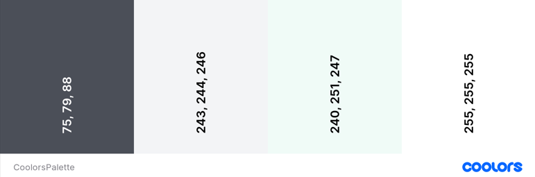
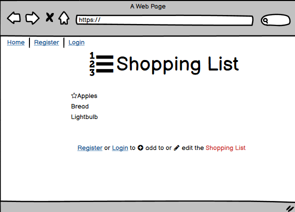
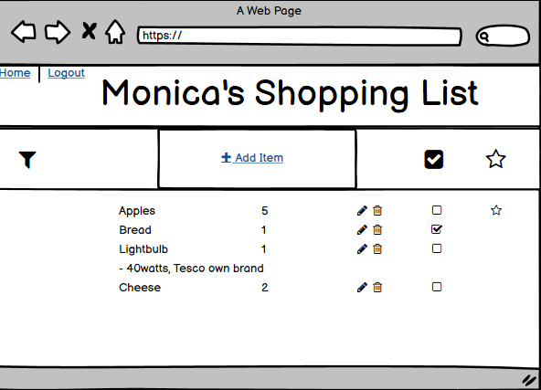
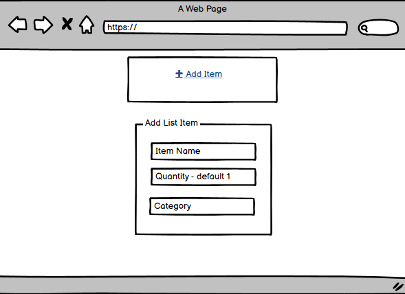
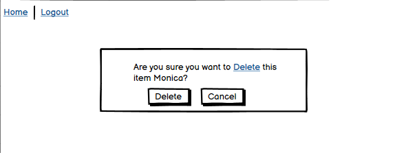
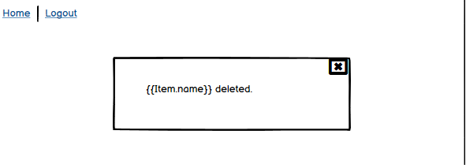
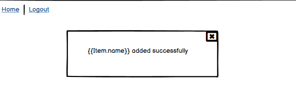

**THE SHOPPING LIST
Organised | Everywhere**

- A Shopping List application

User's Goal

- A User of The Shopping List wants to have a shopping list available on the go, on their portable device, secure thanks to login requirements to access their account.  A user wants to create their shopping list, add items to the list, edit items, add comments, mark items as urgent or as done, and delete items from their shopping list.

- A User wants response messages to their actions, sucessful or unsuccessful.

*Add an image of the finished site here. I like to use amiresponsive to get an image of my site on all device sizes, and amiresponsive allows you to click links on the page and scroll, so each device can show a different element of your site.*

Please visit the live site via [this link](https://mym-shopping-list.herokuapp.com/).

**CONTENTS**

1. [User Experience(UX)](#ux)

2.  [Agile Methodologies](#agile)

3.  [Design](#design)

- Colour Scheme
- Typography
- Imagery
- Wireframes

4.  [Features](#features)

- General Features on Each Page
- Future Implementations
- Accessibility

5.  [Technologies](#technologies)

- Languages Used
- Frameworks, Libraries & Programs Used
- Deployment & Local Development

6. [Testing](#testing)

- Link to [Testing.md](TESTING.md)

7. [Deployment](#deployment)

- Local Development
- How to Fork
- How to Clone

8. [Credits](#credits)

- Code Used
- Content
- Media
- Acknowledgments

**USER EXPERIENCE (UX) DESIGN**

- Strategy

Our user is looking for a efficient convenient means of maintaining a shopping list, having it to hand when shopping, and sharing it with household members. Branding should be clean, uncluttered, without distraction, but not sparse.  The features are created with user ease of use in mind.

- Scope

A simple, uncomplicated, uncluttered shopping list is the Minimum Viable Product (MVP). Features are: 

    - Responsive design,
    - Minimum one-page custom HTML and CSS webpage,
    - User Registration, 
    - User Login/Logout, 
    - CRUD - Create, Add, Update and Delete items on the list,

The six-week deadline is fixed and the timeline is tight.  MVP is priority.  

- Structure

User will only have access to features and functionality following registration and login and has restricted shopping list view until successful login.  Registration and Login links are on the Nav bar and also on a reminder text paragraph underneath the restricted shopping list.  Successful login expands Home page view and returns an authenticated view of Shopping list, with add, edit, star, filter and delete features.  Logout feature is automatic following successful login and appears on Nav bar.  Logout returns the user to restricted list view.

- Skeleton

Visual iconography for ease of use, repeated on each page in the same location where appropriate.  A user will be familiar with clicking on icons to perform an action, this app will conform with this convention.  Uncluttered, simple UI. Use of wireframes to confirm the important information is seen first and to ensure labels, navigation and arrangement will make sense to the user.

- Surface

Colours will be crisp, clean, sophisticated.  Black on white, cool clean colour palette.  White background #ffffff, dark grey text #4b4f58, list container colour rgba (240, 251, 247, 1) or #f3f4f6.  Fonts will follow the clean, uncluttered scope with Roboto, Caveat Semi-bold 600, Nanum Myeongjo Regular 400 in combination look sleak and are easy to read on all devices.

The User's interaction with this application should be easy and natural.  Use of icons will make actions like add, edit and delete intuitive. Efficient use of response messages will confirm successful actions to the user, with unsuccessful action messages easy to understand.

**AGILE METHODOLOGY**

Please follow this link to open my [AGILE.md](AGILE.md) file and read about how I used Agile Methodology in the planning and development of The Shopping List application.

**DESIGN**

I began my design of the database structure by creating an Entity Relationship Diagram, which can be viewed [here](assets/images/Shopping List ERD.png).  The Diagram helped me to consider what to include in each Model and the relationships between the models of the database.
 
Colour Scheme

The Shopping List colour scheme is designed to be crisp, clean, sophisticated.  I used [Coolors](https://coolors.co) to generate a . 

These colours were chosen based on a possible homepage image I used during early development of a  which looked effortlessly organised and calming.

Typography

Google Fonts was used for the following fonts:

Roboto is used as a traditional, backup font.

Nanum Myeongjo is used for the header text on the site, Regular 400 weight. It is a sans-serif font.

Caveat font is used for the shopping list items, SemiBold 600 weight. It is a cursive font and suits a traditional handwritten shopping list style.

Imagery
*Use this section to explain what sort of imagery you plan to use through your site*.

**WIREFRAMES**

I created my wireframes using Balsamiq.

Early UX Design Wireframe images

Registration/Authentication

The following are the Wireframes I created to represent how the Registration, Login and Logout user views will appear.

Restricted view of Homepage to an unregistered user

User Registration form 

Registered user Login form 

User Authentication Confirmed, with additional user functionality 

CRUD

Add Item form

Edit Item form

Delete Item Confirmation page

User Messages Wireframes

These messages will be presented to the User as Flash messages which will automatically close after 3 seconds.

**Features**

*This section can be used to explain what pages your site is made up of.*

General features on each page

If there is a feature that appears on all pages of your site, include it here. Examples of what to include would the the navigation, a footer and a favicon.

I then like to add a screenshot of each page of the site here, i use amiresponsive which allows me to grab an image of the site as it would be displayed on mobile, tablet and desktop, this helps to show the responsiveness of the site.

Future Implementations

What features would you like to implement in the future on your site? Would you like to add more pages, or create login functionality? Add these plans here.

Accessibility

Be an amazing developer and get used to thinking about accessibility in all of your projects!

This is the place to make a note of anything you have done with accessibility in mind. Some examples include:

Have you used icons and added aria-labels to enable screen readers to understand these? Have you ensured your site meets the minimum contrast requirements? Have you chosen fonts that are dyslexia/accessible friendly?

Code Institute have an amazing channel for all things accessibility (a11y-accessibility) I would highly recommend joining this channel as it contains a wealth of information about accessibility and what we can do as developers to be more inclusive.

**Technologies Used**

Languages Used

Languages in this project were Python, HTML, CSS and JavaScript.

Frameworks, Libraries & Programs Used

- Balsamiq Version: 4.5.5 - Editor Version: 5.3.1 - Used to create wireframes.

- GitPod - The Cloud development environment used to develop the site.

- Google Fonts - To import the fonts used on the website.

- Google Developer Tools - To troubleshoot and test features, solve issues with responsiveness and styling.

- TinyPNG - To compress the Organiser image

- Am I Responsive? To show the website image on a range of devices.

- Django framework and Bootstrap CSS were both used in this project.

- Fontawesome - Used for icons.

- Heroku and ElephantSQL - For deployment and Hosting of the project.

- GitHub - Distributed Version Control;

- Smartdraw - To create the Entity Relationship Model - ERD 2 Template.

**Testing**

Testing is documented in TESTING.md file [here](TESTING.md)

**Credits**

This project is based on and borrows from the design of both the 'Hello Django' and the 'Django Blog' Walkthrough projects during the CI Module on FST Frameworks. 

README.md - I used the [README.md example](https://github.com/kera-cudmore/readme-examples/blob/main/milestone1-readme.md) by Kera Kudmore to plan and layout my headings and content, to ensure I didn't omit any important content.

On the CI Slack Community I saw a reference to [this YouTube video](https://www.youtube.com/watch?v=RwWhQTSV44Q) on building a CRUD Application using Class-based views, which helped supplement the learning from the FST Django Module from this course, in particular using CreateView to add an item to the database, and the reference to Django Widget Tweaks to collect the fields from the database and render form input elements in a html file if necessary.

- On further research about [Widget Tweaks](https://pypi.org/project/django-widget-tweaks/) and looking at the [following YouTube video](https://www.google.com/search?q=django+widget-tweaks+vs+crispy-forms&rlz=1C1ONGR_enIE1019IE1019&sxsrf=AJOqlzWoraYzLPN2lHNHFLqvsMPTx369yA%3A1678736692259&ei=NH0PZMmbD9CGgQbl2pzgAg&oq=is+django+widget+tweaks+the+same+as+crispy&gs_lcp=Cgxnd3Mtd2l6LXNlcnAQARgEMgoIABBHENYEELADMgoIABBHENYEELADMgoIABBHENYEELADMgoIABBHENYEELADMgoIABBHENYEELADMgoIABBHENYEELADMgoIABBHENYEELADMgoIABBHENYEELADSgQIQRgAUABYAGDDFmgBcAF4AIABAIgBAJIBAJgBAMgBCMABAQ&sclient=gws-wiz-serp#fpstate=ive&vld=cid:b254270b,vid:ynToND_xOAM), it appears to be the most Pythonic way to create forms for my project.

I found Dee Mc's YouTube videos on creating a [Django Recipe Sharing tutorial](https://www.youtube.com/watch?v=E9eWdZTpiGA&list=PLXuTq6OsqZjbCSfiLNb2f1FOs8viArjWy&index=4) useful to solidify what had been taught on the FSF Django module as she explained similar aspects in a different way that made sense to me.  For example, Dee Mc uses Django to load static files such as style.css using the curly braces syntax which I am already using for all href links throughout the project, and once I saw this it made perfect sense to extend this syntax to use within the head tags of of my templates.  Another conditional statement used on this Recipe Sharing tutorial was the one adding the 'active' class to the navigation bar which I also included in this Project.

Reverse_lazy tool was referenced in [this YouTube video](https://www.youtube.com/watch?v=RwWhQTSV44Q) which is a tool I imported from django.urls and used in my Create function to return the user to the home page upon successfully adding a new item to the shopping list.

Though ultimately not an ideal fix to how to scroll my user's shopping list, [this Stack Overflow](https://stackoverflow.com/questions/21168521/table-fixed-header-and-scrollable-body) question and the answers provided helped me to troubleshoot how to best display the shopping list in a table.

Tutor Support helped me to understand how to create an inline view of a model within the Admin section by sharing [this letscodemore link](https://www.letscodemore.com/blog/django-inline-admin-with-examples/).

Due to the requirment to have custom user messages throughout this project I could not use standard Django 403 error message to return an error to the users of The Shopping List as it was too generic.  Instead I created a [custom 403 template](https://stackoverflow.com/questions/31981239/django-custom-403-template) to relay a very simple but more elegant 403 forbidden error message where required.

**Acknowledgments**

The CI Slack Community is a a resource I used almost as much as Google for this project, to bounce ideas, ask for advice, and seek guidance where code went awry.  

CI Tutor Support were also a well-used resource for this project and I'm grateful to all the patient Tutors from whome I received a huge amount of reasurance and guidance.

**Deployment**

The site is deployed using Heroku - [MYM Shopping List](https://mym-shopping-list.herokuapp.com/)

To Deploy the site using Heroku:

- Login (or signup) to Heroku;
- From the dashboard, click on 'New' and select 'Create New App';
- Populate the App Name field with your new Project or Application name, and select your local region ie. Europe. Click 'Create App' button.

The app is now created and is listed in the Heroku dashboard.

In the 'Settings' tab, add the Config Variables:

- DATABASE_URL: 'Paste ElephantSQL URL';
- SECRET_KEY: 'Paste in your secret key';
- PORT: 8000;
- CLOUDINARY_URL: Cloudinary://*.

In the 'Deploy' tab:
- Select 'GitHub' from the Deployment method section;
- Connect to the GitHub repository for this project;
- Select 'Enable Automatic Deploys' from the the Automatic Deploy section.

Create a new database on ElephantSQL

Heroku uses an ephemeral file system - which means it is wiped clean every time Heroku updates, or every time the app is redeployed.

So Gunicorn which will act as the web server for the project, and the project will also use a server-based database called 'Postgres'.  It will be seperated from the  application, so it will survive even if the application server is destroyed.

To Create the Postgres database:

- Login or signup to ElephantSQL;
- Click 'Create New Instance';
- Populate the 'Name' field with the name of the Project or Application;
- Leave the 'Plan' field with the pre-populated Tiny Turtle content;
- Leave the 'Tags' field blank;
- Click the 'Select Region' button and choose 'EU-West-1' as the local region;
- Click the 'Review' button, ensure all the content is correct, with the correct spelling, then click 'Create Instance'.

The Postgres database is now created on ElephantSQL and you can see it on your ElephantSQL dashboard. 

Connect Gitpod development environment to Postgres database

Through Gitpod, connect ElephantSQL through settings.py with a variable named 'DATABASE_URL', and then migrate the database structure to the newly connected ElephantSQL database.

Test the connection in ElephantSQL:

- Select the database instance from the dashboard;
- Select 'Browser' tab, then click on 'Table Queries'.

You should see that the dropped down list has been populated from the Django migrations.

Create Procfile in Gitpod

Heroku needs a Profile so it knows how to run a project.

In the newly created Procfile, add the line 'web: gunicorn PROJECTNAME.wsgi'.
 - 'web:' tells Heroku that this is a process that should accept http traffic;
 - 'gunicorn' is a web server installed for the project, a web services gateway server;
 - '.wsgi' stands for 'web services gateway server' and is the standard that allows Python services to integrate with web servers.

 The Project is now successfully deployed.
 .

How to Fork

A Fork of a repository is a copy of the original repository that you now own. Any changes made to the project in your fork will not affect the original. 

To make a fork, go to my [repository](https://github.com/MoniMurray/shopping-list), and click on the "Fork" button in the top right of the screen. The window should then refresh, and you should be redirected to your newly created Fork of the project.

How to Clone

Go to the forked (which is the copy of the original, you made above) repository in Github under your list of repositories. Click on the green "Code" button and from the panel, in the 'Local' tab select the 'HTTPS' tab and click the icon to copy the prepopulated link.
In Gitpod click on the green 'Gitpod' button and the cloned repository will open for editing.  If you use an alternative IDE/Editor, open the CLI and type the following: 

git clone {insert the copied url here} 

The Forked repository will now clone to your preferred development method.

