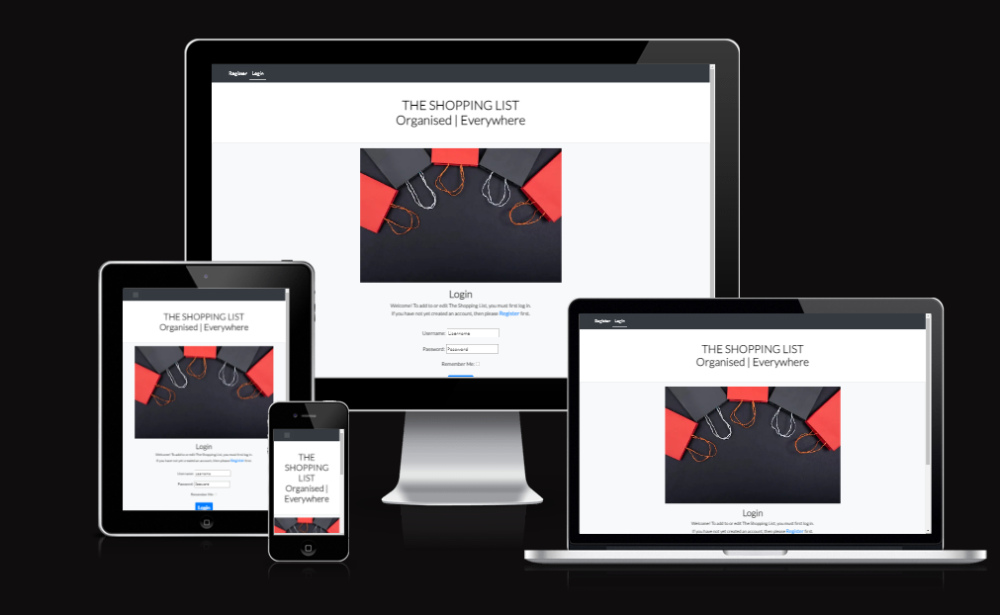
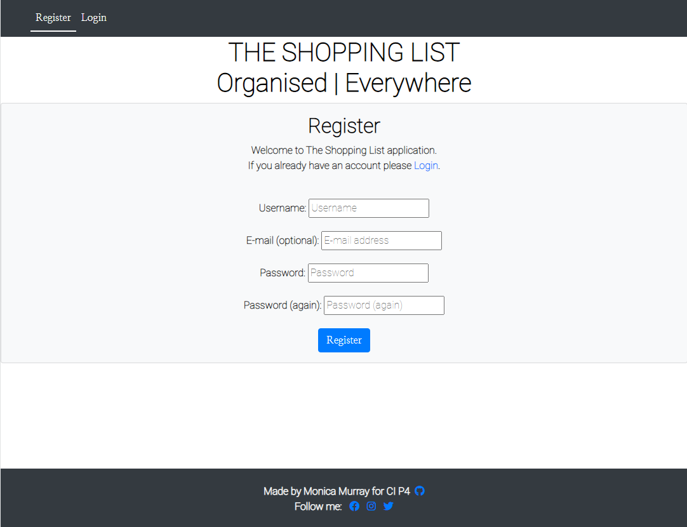
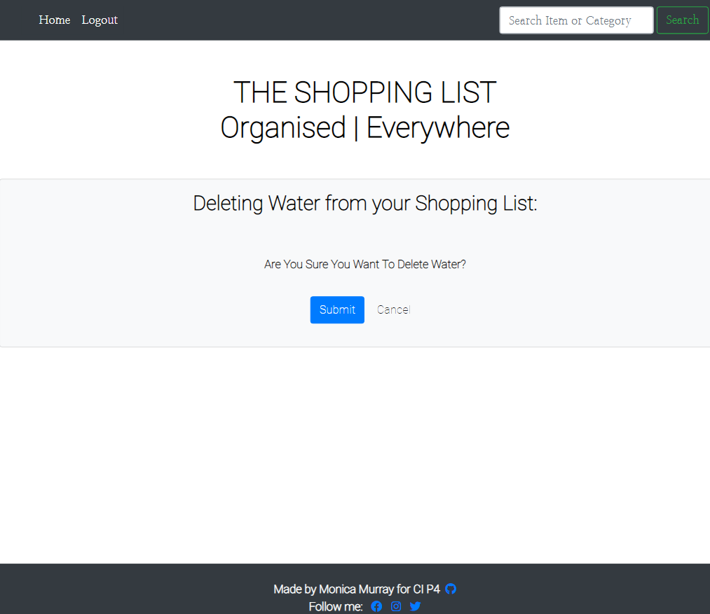
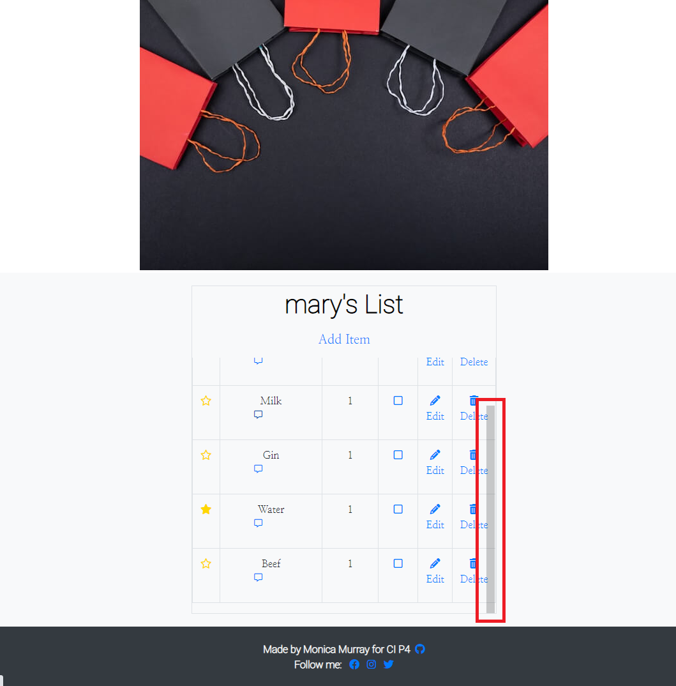

**THE SHOPPING LIST
Organised | Everywhere**

- A Shopping List application

User's Goal

- A User of The Shopping List wants to have a shopping list available on the go, on their portable device, secure thanks to login requirements to access their account.  A user wants to create their shopping list, add items to the list, edit items, add comments, mark items as urgent or as done, and delete items from their shopping list.

- A User wants response messages to their actions, sucessful or unsuccessful.

An image of the finished site generated from [Amiresponsive](https://ui.dev/amiresponsive?url=https://8000-monimurray-shoppinglist-wasy52ssiii.ws-eu93.gitpod.io/) which displays the application at four screen size breakpoints.

 

Please visit the live site via [this link](https://mym-shopping-list.herokuapp.com/).

**CONTENTS**

1. [User Experience(UX)](#ux)

2.  [Agile Methodologies](#agile)

3.  [Design](#design)

4.  [Features](#features)

5.  [Technologies](#technologies)

6. [Testing](#testing)

7. [Deployment](#deployment)

8. [Credits](#credits)

**USER EXPERIENCE (UX) DESIGN**

- Strategy

Our user is looking for an efficient and convenient means of maintaining a shopping list, having it to hand when shopping, being able to filter by category. Branding should be clean, uncluttered, without distraction, but not sparse.  The features are created with user ease of use in mind.

- Scope

A simple, uncomplicated, uncluttered shopping list with the following features is the Minimum Viable Product (MVP): 

    - Responsive design,
    - Minimum one-page custom HTML and CSS webpage,
    - User Registration, 
    - User Login/Logout, 
    - CRUD - Create, Add, Update and Delete items on the list,

The six-week deadline is fixed and the timeline is tight.  MVP is priority.  

- Structure

User will only have access to features and functionality following registration.  Registration and Login links are on the Nav bar and also on a reminder text paragraph on the Landing page.  Successful login expands to a 'Home' page view and returns an authenticated view of Shopping list, with add, edit, delete, toggling, and search features.  Logout feature is automatic following successful login and appears on navigation bar.  Logout returns the user to Login page.

- Skeleton

Visual icon employed for ease of use, repeated on each page in the same location where appropriate.  A user will be familiar with clicking on icons to perform an action, this app will conform with this convention.  Uncluttered, simple UI. Use of wireframes to confirm the important information is seen first and to ensure labels, navigation and arrangement will make sense to the user.

- Surface

Colours will be crisp, clean, sophisticated.  Black on white, cool clean colour palette.  White background #ffffff, dark grey #4b4f58 or black text for accessibility, list container colour rgba (240, 251, 247, 1), #f3f4f6 or black.  Fonts will follow the clean, uncluttered scope with Roboto, Caveat, Nanum Myeongjo in combination look sleak and are easy to read on all devices.

The User's interaction with this responsive application should be easy and natural.  Use of icons will make actions like edit and delete intuitive. Efficient use of response messages will confirm successful actions to the user, with unsuccessful action messages easy to understand.

**AGILE METHODOLOGY**

Please follow this link to open my [AGILE.md](AGILE.md) file and read about how I used Agile Methodology in the planning and development of The Shopping List application.

**DESIGN**

I began my design of the database structure by creating an Entity Relationship Diagram, which can be viewed [here](static/images/wireframes/Shopping_List_ERD.png).  The Diagram helped me to consider what to include in each Model and the relationships between the models of the database.
 

Colour Scheme

The Shopping List colour scheme is designed to be crisp, clean, sophisticated.  I used [Coolors](https://coolors.co) to generate a colour palette.

. 

These colours were chosen based on a possible homepage image I used during early development of a personal organiser which employed a colour palette which was cool and calming.

 .

Typography

Google Fonts was used for the following fonts:

Roboto is used as a traditional, backup font.

Roboto is used for the header text on the site, 700 weight. It is a sans-serif font.

Nanum Myeongjo font is used for the shopping list items, 300 weight. It is a lighter font and font-weight and suits a traditional handwritten shopping list style.

Wireframes

I created my wireframes using Balsamiq to create the early UX Design Wireframe images.

- Registration/Authentication

The following are the Wireframes I created to represent how the Registration, Login and Logout user views will appear.

Restricted view of Homepage to an unregistered user

User Registration form 

Registered user Login form 

User Authentication Confirmed, with additional user functionality 

- CRUD

Add Item form

Edit Item form

Delete Item Confirmation page

- User Messages Wireframes

These messages will be presented to the User as Flash messages which will automatically close after 3 seconds.

The Entity Relationship Model for the relational database was first created on paper and then a model designed using Smartdraw.

**FEATURES**

The Shopping List is a useful tool for a User to create and update their shopping list wherever they are on their available device.  The User can group shopping list items by category for ease of use when shopping, can see urgent items at a glance when in a hurry, and can easily toggle items off the list as they shop.

Landing Page

On first arriving to the site the user is presented with an uncluttered Login page with simple instruction to the user to Login to access the features of the application.  If the User is not yet Registered, there is a link in the text and also in the navigation bar for a new user to follow in order to Register for an account.  

Bespoke pages for following are launched from the navigation bar on the Landing page:

- Register
- Login

Home Page

Following Registration or Login, all features and functionality for the application are contained in the 'Home' page.  On the 'Home' page, a user can add a new shopping list item to their list, toggle the gold star on/off to mark the item as urgent, toggle the checkbox on/off to mark an item as done, add a note to the item using the note icon, and also edit and delete an item using the edit and delete icons.  

The contents of The Shopping List, when there are any, are displayed in a table on the 'Home' page.

Bespoke pages for following are launched from the Home page:

- Logout
- Search function
- Add item
- Edit item
- Delete item
- Add note
- 403 Error page.

General features on each page

- The Navigation Bar 

Pre-Registration the Navigation bar contains two links - Registration and Login.

After user has logged in, the Navigation bar changes to contain Home, Logout and a Search feature.

- Search Feature

A User can search The Shopping List by the name of an item or by Category of items and that item or items will be returned to the user in the table.

- Footer

The bespoke footer contains a line of text "Made by Monica Murray for CI P4" with an external link to my GitHub profile. The footer also contains external links to Facebook, Instagram and Twitter.

Screenshots

Login Page, small screen navigation view. 

Login Page, large screen navigation view.

Register Page

Home Page, flash successful login message.

Home Page

Logout Page

Logout Page, flash success message.

Search Function

Add Item to The Shopping List

Add Item, flash success message

Edit Item on The Shopping List

Edit Item, flash success message

Delete Item

Scroll table list

Add Note

403 Page

Future Implementations

Future features of the application would be to add additional organiser functions to plan calendar events, holidays and finances with links to these features added to Navigation and launching as seperate features for the Registered User.

Accessibility

Be an amazing developer and get used to thinking about accessibility in all of your projects!

This is the place to make a note of anything you have done with accessibility in mind. Some examples include:

I have used [fontawesome](https://fontawesome.com/search?q=checkbox&o=r&m=free) icons in my application and to each icon I have added aria-labels to enable screen readers to understand them.  I have endeavored to ensure the application meets the minimum contrast requirements between background and text colours.  I have chosen font sizes and type that are dyslexia/accessible friendly, for example there are no buttons or text that are in all capitals.

**TECHNOLOGIES USED**

Languages Used

Languages in this project were Python, HTML, CSS and JavaScript.

Frameworks, Libraries & Programs Used

- Balsamiq Version: 4.5.5 - Editor Version: 5.3.1 - Used to create wireframes.

- GitPod - The Cloud development environment used to develop the site.

- Google Fonts - To import the fonts used on the website.

- Google Developer Tools - To troubleshoot and test features, solve issues with responsiveness and styling.

- TinyPNG - To compress the Organiser image

- Am I Responsive? To show the website image on a range of devices.

- Django framework and Bootstrap CSS were both used in this project.

- Fontawesome - Used for icons.

- Heroku and ElephantSQL - For deployment and Hosting of the project.

- GitHub - Distributed Version Control;

- Smartdraw - To create the Entity Relationship Model - ERD 2 Template.

**TESTING**

Testing is documented in TESTING.md file [here](TESTING.md)

**CREDITS**

This project is based on and borrows from the design of both the 'Hello Django' and the 'Django Blog' Walkthrough projects during the CI Module on FST Frameworks. 

README.md - I used the [README.md example](https://github.com/kera-cudmore/readme-examples/blob/main/milestone1-readme.md) by Kera Kudmore to plan and layout my headings and content, to ensure I didn't omit any important content.

On the CI Slack Community I saw a reference to [this YouTube video](https://www.youtube.com/watch?v=RwWhQTSV44Q) on building a CRUD Application using Class-based views, which helped supplement the learning from the FST Django Module from this course, in particular using CreateView to add an item to the database, and the reference to Django Widget Tweaks to collect the fields from the database and render form input elements in a html file if necessary.

- On further research about [Widget Tweaks](https://pypi.org/project/django-widget-tweaks/) and looking at the [following YouTube video](https://www.google.com/search?q=django+widget-tweaks+vs+crispy-forms&rlz=1C1ONGR_enIE1019IE1019&sxsrf=AJOqlzWoraYzLPN2lHNHFLqvsMPTx369yA%3A1678736692259&ei=NH0PZMmbD9CGgQbl2pzgAg&oq=is+django+widget+tweaks+the+same+as+crispy&gs_lcp=Cgxnd3Mtd2l6LXNlcnAQARgEMgoIABBHENYEELADMgoIABBHENYEELADMgoIABBHENYEELADMgoIABBHENYEELADMgoIABBHENYEELADMgoIABBHENYEELADMgoIABBHENYEELADMgoIABBHENYEELADSgQIQRgAUABYAGDDFmgBcAF4AIABAIgBAJIBAJgBAMgBCMABAQ&sclient=gws-wiz-serp#fpstate=ive&vld=cid:b254270b,vid:ynToND_xOAM), it appears to be the most Pythonic way to create forms for my project.

I found Dee Mc's YouTube videos on creating a [Django Recipe Sharing tutorial](https://www.youtube.com/watch?v=E9eWdZTpiGA&list=PLXuTq6OsqZjbCSfiLNb2f1FOs8viArjWy&index=4) useful to solidify what had been taught on the FSF Django module as she explained similar aspects in a different way that made sense to me.  For example, Dee Mc uses Django to load static files such as style.css using the curly braces syntax which I am already using for all href links throughout the project, and once I saw this it made perfect sense to extend this syntax to use within the head tags of of my templates.  Another conditional statement used on this Recipe Sharing tutorial was the one adding the 'active' class to the navigation bar which I also included in this Project.

- when I researched how to fix the Login bug which is documented in my [TESTING.md](TESTING.md) file under 'Manual Testing', I once again found this tutorial particularly useful in its explanation of Mixins and how and where to apply them.

Reverse_lazy tool was referenced in [this YouTube video](https://www.youtube.com/watch?v=RwWhQTSV44Q) which is a tool I imported from django.urls and used in my Create function to return the user to the home page upon successfully adding a new item to the shopping list.

Though ultimately not an ideal fix to how to scroll my user's shopping list, [this Stack Overflow](https://stackoverflow.com/questions/21168521/table-fixed-header-and-scrollable-body) question and the answers provided helped me to troubleshoot how to best display the shopping list in a table.

In order to make my table responsive at small screen sizes I added a CSS breakpoint to screens with a max-width of 600px to hide the row of table headers, and display the table rows as table columns instead, removing the need for horizontal scrolling for the application user.  I used Javascript to look for heading cells in a thead element, and reassign them as HTML attributes to data cells in a tbody element. Using the breakpoint in CSS, I hide the row of table headers, rearrange the table rows into columns, and add the content of the rows to each data cell.  I used the code in this [wpDataTables article](https://wpdatatables.com/how-to-make-a-table-responsive/) to achieve this responsiveness.

Tutor Support helped me to understand how to create an inline view of a model within the Admin section by sharing [this letscodemore link](https://www.letscodemore.com/blog/django-inline-admin-with-examples/).

Due to the requirment to have custom user messages throughout this project I could not use standard Django 403 error message to return an error to the users of The Shopping List as it was too generic.  Instead I created a [custom 403 template](https://stackoverflow.com/questions/31981239/django-custom-403-template) to relay a very simple but more elegant 403 forbidden error message where required.  It may never be needed, but will maintain the Users connection with the application if it is.

Fixing the footer to the bottom of the page was achieved using [this SO link](https://stackoverflow.com/questions/10099422/flushing-footer-to-bottom-of-the-page-twitter-bootstrap).

Searching for items on The Shopping List and filtering the list by category is an important feature in my design.  When researching the way to use Django's filter method I Googled and found [this django filter package article](https://www.codechit.com/django-filter-search-form-guide/) which initially I thought would be very useful, until I realised that I could extend the filter method I was already using in my application to display the current logged in user's list.  As as result the django filter package was installed but not subsequently used.

Acknowledgments

The CI Slack Community is a resource I used almost as much as Google for this project! This community is so kind and generous with their collective and individual knowlege and I used them to bounce ideas off, ask for advice, and to seek guidance where code went awry.  

CI Tutor Support were also a well-used resource for this project and I'm grateful to all the patient Tutors from whom I received a huge amount of reasurance and guidance.

**DEPLOYMENT**

The site is deployed using Heroku - [MYM Shopping List](https://mym-shopping-list.herokuapp.com/)

To Deploy the site using Heroku:

- Login (or signup) to Heroku;
- From the dashboard, click on 'New' and select 'Create New App';
- Populate the App Name field with your new Project or Application name, and select your local region ie. Europe. Click 'Create App' button.

The app is now created and is listed in the Heroku dashboard.

In the 'Settings' tab, add the Config Variables:

- DATABASE_URL: 'Paste ElephantSQL URL';
- SECRET_KEY: 'Paste in your secret key';
- PORT: 8000;
- CLOUDINARY_URL: Cloudinary://*.

In the 'Deploy' tab:
- Select 'GitHub' from the Deployment method section;
- Connect to the GitHub repository for this project;
- Select 'Enable Automatic Deploys' from the the Automatic Deploy section.

Create a new database on ElephantSQL

Heroku uses an ephemeral file system - which means it is wiped clean every time Heroku updates, or every time the app is redeployed.

So Gunicorn which will act as the web server for the project, and the project will also use a server-based database called 'Postgres'.  It will be seperated from the  application, so it will survive even if the application server is destroyed.

To Create the Postgres database:

- Login or signup to ElephantSQL;
- Click 'Create New Instance';
- Populate the 'Name' field with the name of the Project or Application;
- Leave the 'Plan' field with the pre-populated Tiny Turtle content;
- Leave the 'Tags' field blank;
- Click the 'Select Region' button and choose 'EU-West-1' as the local region;
- Click the 'Review' button, ensure all the content is correct, with the correct spelling, then click 'Create Instance'.

The Postgres database is now created on ElephantSQL and you can see it on your ElephantSQL dashboard. 

Connect Gitpod development environment to Postgres database

Through Gitpod, connect ElephantSQL through settings.py with a variable named 'DATABASE_URL', and then migrate the database structure to the newly connected ElephantSQL database.

Test the connection in ElephantSQL:

- Select the database instance from the dashboard;
- Select 'Browser' tab, then click on 'Table Queries'.

You should see that the dropped down list has been populated from the Django migrations.

Create Procfile in Gitpod

Heroku needs a Profile so it knows how to run a project.

In the newly created Procfile, add the line 'web: gunicorn PROJECTNAME.wsgi'.
 - 'web:' tells Heroku that this is a process that should accept http traffic;
 - 'gunicorn' is a web server installed for the project, a web services gateway server;
 - '.wsgi' stands for 'web services gateway server' and is the standard that allows Python services to integrate with web servers.

 The Project is now successfully deployed.
 .

How to Fork

A Fork of a repository is a copy of the original repository that you now own. Any changes made to the project in your fork will not affect the original. 

To make a fork, go to my [repository](https://github.com/MoniMurray/shopping-list), and click on the "Fork" button in the top right of the screen. The window should then refresh, and you should be redirected to your newly created Fork of the project.

How to Clone

Go to the forked (which is the copy of the original, you made above) repository in Github under your list of repositories. Click on the green "Code" button and from the panel, in the 'Local' tab select the 'HTTPS' tab and click the icon to copy the prepopulated link.
In Gitpod click on the green 'Gitpod' button and the cloned repository will open for editing.  If you use an alternative IDE/Editor, open the CLI and type the following: 

git clone {insert the copied url here} 

The Forked repository will now clone to your preferred development method.

