PROJECT PORTFOLIO 4 THE SHOPPING LIST - TESTING

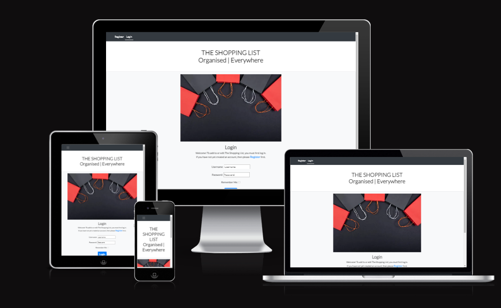

CONTENTS

1. [AUTOMATED TESTING](#automated_testing)

2. [MANUAL TESTING](#manual_testing)

AUTOMATED TESTING

Automated Testing includes all testing that is carried out by a program -  W3C HTML validation and CSS Validation, PEP8 Python Compliance, Lighthouse responsiveness.

 W3C Validator

The most popular HTML validator is W3C. 

[W3C URL Validator](https://validator.w3.org/nu/?doc=https%3A%2F%2Fmym-shopping-list.herokuapp.com%2F)

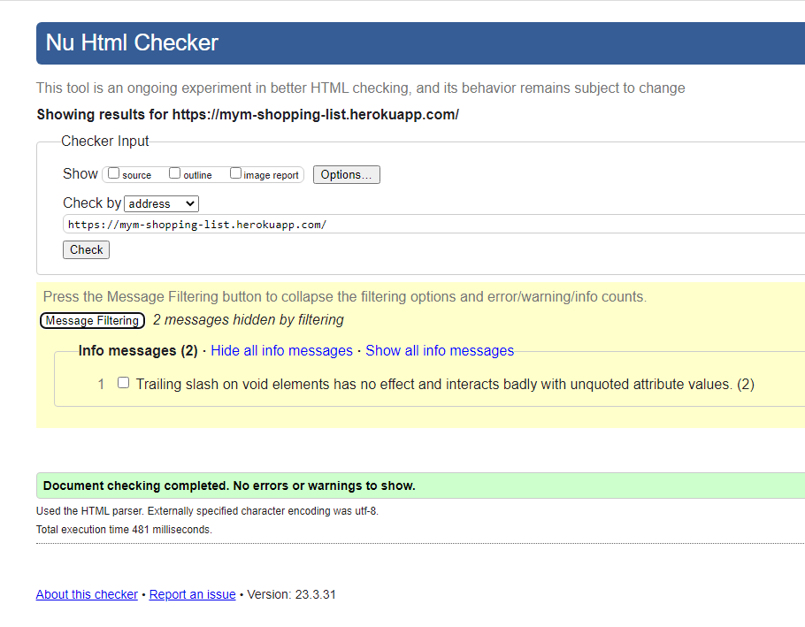

CSS Validation

CSS Validation can only be done by copying and pasting the CSS file contents into the direct input. 

[W3C CSS Validation](https://jigsaw.w3.org/css-validator/validator)

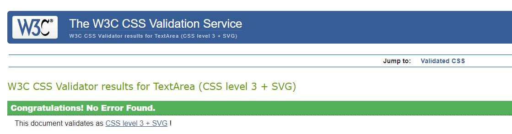

Python Code testing

[CI Python Linter](https://pep8ci.herokuapp.com/)

All clear, no errors found.

The following files were tested:

- views.py
- admin.py
- forms.py
- models.py
- test_views.py
- test_models.py

Lighthouse

Lighthouse Testing is part of the Chrome Developer Tools. For more information on how to use this tool, please visit chrome Lighthouse.

You will need to run the Lighthouse testing on each individual page of your site, for desktop as a minimum. If you have time it would be great to also add in the mobile testing.

Login page - Desktop

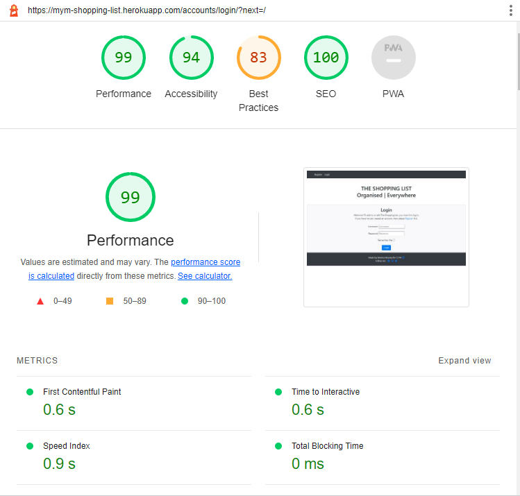

Register page - Desktop

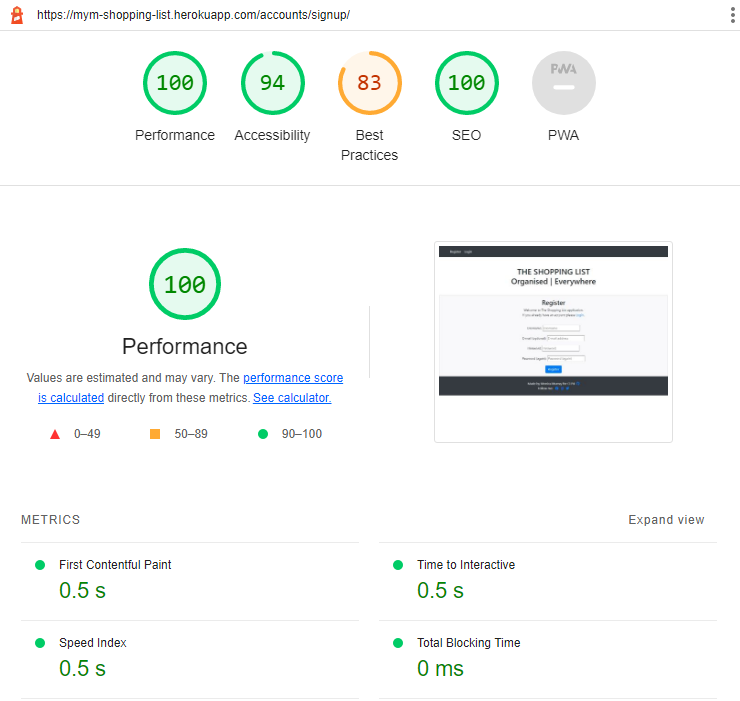

Logout page - Desktop

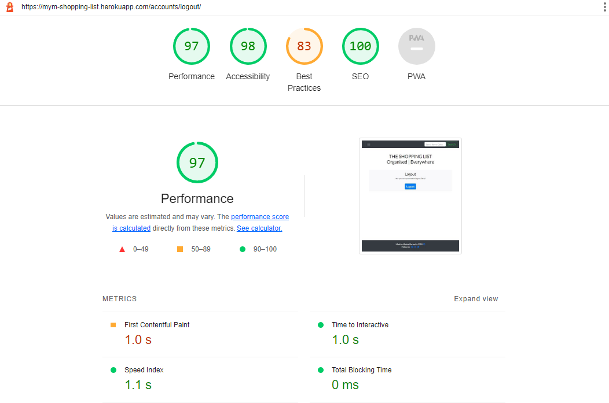

Home page - Desktop

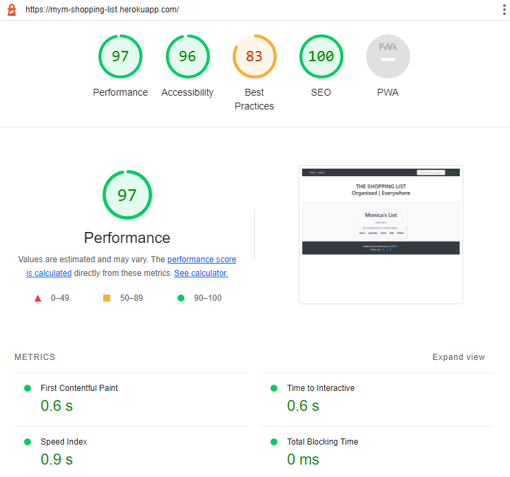

Add Item page - Desktop

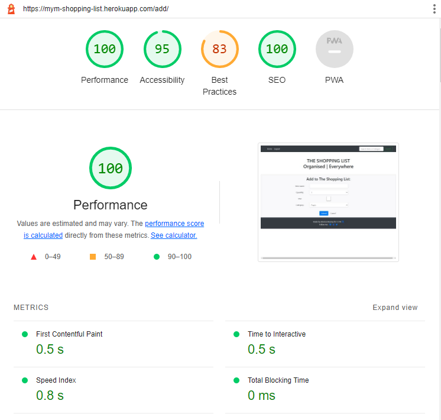

Edit Item page - Desktop

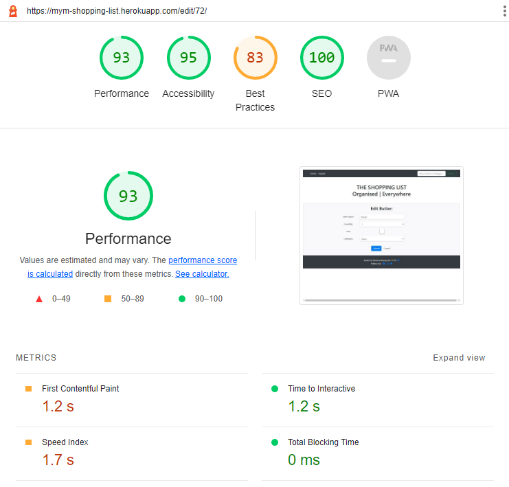

Delete Item page - Desktop

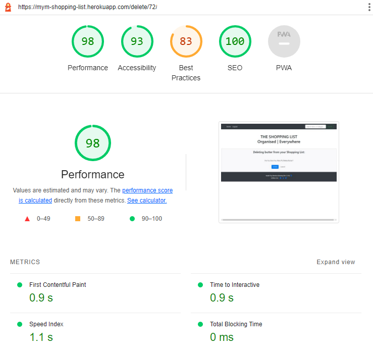

Add Note page - Desktop

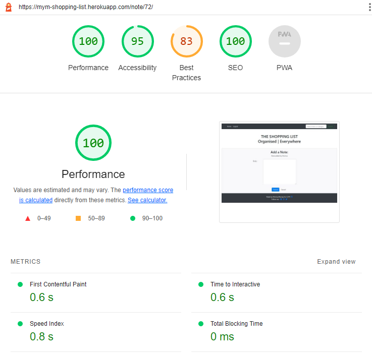

I tested this project using [Django TestCase](https://docs.djangoproject.com/en/4.1/topics/testing/overview/)

Testing Features
👩🏻‍💻 View a feature list table here

This is where you will test the features as you create them in the README against your site. Use a table for this section - base the table on the User Acceptance Criteria for the User Cases.

Coverage Tool

The Coverage testing tool evaluates your whole project and reports on what percentage of the project has been tested with automated testing.  This tool needs to be installed, in the CLI type:  

pip3 install coverage

To run the Coverage tool, in the CLI type:

coverage run --source=list manage.py test

Coverage tells you what percentage of the application's code has been tested - it does not tell you what percentage of your code passed the tests. Coverage generates a report in HTML, in the CLI type:

coverage report

To generate an interactive HTML report use the following command in the CLI:

coverage html

This will create a new folder called 'htmlcov' in which there is an index.html file.  As with all html files, in order to view the file, in the CLI type:

python3 -m http.server

Open the browser to inspect files which will indicate where in the application tests still need to be performed.

Write any remaining tests Coverage reports has gone untested.

BUGS
Known Bugs
List (or put in a table) all known bugs on your site here as soon as you find them. This will prevent you from forgetting any at the end. Some (if not all) of these bugs will hopefully make their way over to the next section, solved bugs, as you progress through your project.

Solved Bugs
👩🏻‍💻View an example of a completed bugs section here

This is where all solved bugs go once squashed. List what the bug was, and how you managed to fix it. You can also include images/videos here if you wanted.

MANUAL TESTING

Manual testing tests as follows:

- Each Feature
- Each User Story
- Visual Responsiveness
- Browser Compatibility Testing
- Report on Bugs resolves/unresolved

Testing User Stories

This is where I tested the User Stories I created and listed in [AGILE.md](AGILE.md) against my application. I have used the User Stories table for this Test Case list, the Acceptance Criteria Tasks are repurposed to become the Tests.

| User Story                                                                                                      | Test Number | Manual Test Expected result list                                                                                                                                                                                                                                                                                                              | Test P/F |
| --------------------------------------------------------------------------------------------------------------- | ----------- | --------------------------------------------------------------------------------------------------------------------------------------------------------------------------------------------------------------------------------------------------------------------------------------------------------------------------------------------- | -------- |
| As a new user I can register to the List App so that I can access all the application's functionality securely. | 1           | Test Registration form launches when user clicks 'Register' links from navigation, and from homepage body paragraph,                                                                                                                                                                                                                 | Pass     |
|                                                                                                                 | 2           | Test Username, password and repeat password are required fields,                                                                                                                                                                                                                                                                              | Pass     |
|                                                                                                                 | 3           | Test clicking 'Register' button when required fields complete launches flash screen message "Welcome {{username}}"                                                                                                                                                                                                                            | Pass     |
|                                                                                                                 | 4           | Test User returned to homepage where navigation now changed to 'Home, Logout' and Search panel.                                                                                                                                                                                                                                               | Pass     |
| As a registered user I can Login with username and password.                                                    | 5           | Test Login form launches when user clicks 'Login' link in Navigation bar, and in the paragraph in the body of homepage,                                                                                                                                                                                                                 | Pass     |
|                                                                                                                 | 6           | Test Username and password are required fields in the form                                                                                                                                                                                                                                                                                    | Pass     |
|                                                                                                                 | 7           | Test clicking 'Submit' when required fields are complete is followed by a flash screen message confirming successful login,                                                                                                                                                                                                                   | Pass     |
|                                                                                                                 | 8           | Test User returned to home page where navigation bar now has 'Logout' and Search panel, and Shopping List is now expanded view with added functions                                                                                                                                                                                           | Pass     |
| As a logged-in user I can Logout of the app when finished using the list.                                       | 9           | Test Logout screen launches when user clicks 'Logout' in Navigation bar,                                                                                                                                                                                                                                                                   | Pass     |
|                                                                                                                 | 10          | Test when user clicks 'Logout' button on Logout screen they are returned to hompage,                                                                                                                                                                                                                                                          | Pass     |
|                                                                                                                 | 11          | Test flash screen message appears when user has clicked 'Logout' button on Logout screen and is returned to homepage,                                                                                                                                                                                                                      | Pass     |
|                                                                                                                 | 12          | Test Navigation bar has changed to 'Home, Register, Login' and Search function has been removed.                                                                                                                                                                                                                                              | Pass     |
| As an unregistered user, I can only see the updated list on the Home page.                                      | 13          | Visually test unregistered user can only see: \- max 3 shopping list items without additional user functionality, or 'The Shopping List is empty' message, \- navigation bar with 'Home, Register, Login' links only, \- paragraph inviting application visitor to Register/Login, with both links launching their respective forms. | Pass     |
| As a logged in user I can click Add so that I can add an item to my List                                        | 14          | Test User can click on 'Add Item' under Shopping List table to launch Add Item form,                                                                                                                                                                                                                                                          | Pass     |
|                                                                                                                 | 15          | Test user can input text into Item name text box,                                                                                                                                                                                                                                                                                             | Pass     |
|                                                                                                                 | 16          | 16.1 Test Quantity drop-down is pre-populated by default with '1', 16.2 Test Quantity drop-down will open, 16.3. Test Quantity drop-down will accept selection of another of the options,                                                                                                                                               | Pass     |
|                                                                                                                 | 17          | 17.1 Test Star checkbox is empty by default, 17.2 Test User can toggle Star checkbox on/off,                                                                                                                                                                                                                                               | Pass     |
|                                                                                                                 | 18          | 18.1 Test Category drop-down is pre-populated with 'Fresh' by default, 18.2 Test Category drop-down launches, 18.3 Test Category drop-down options can be selected,                                                                                                                                                                     | Pass     |
|                                                                                                                 | 19          | Test Cancel button returns User to homepage with no change to Shopping List,                                                                                                                                                                                                                                                                  | Pass     |
|                                                                                                                 | 20          | Test Submit button will cause pop-up user reminders in required input fields left blank,                                                                                                                                                                                                                                                      | Pass     |
|                                                                                                                 | 21          | Test Submit button returns User to homepage with newly added item displaying at top of Shopping List.                                                                                                                                                                                                                                         | Pass     |
| As a logged in user I can click Edit so that I can edit the detail of an item on my List                        | 22          | Test User can click on 'Edit' icon beside any shopping list item to launch Edit Item form,                                                                                                                                                                                                                                                 | Pass     |
|                                                                                                                 | 23          | 23.1 Test Edit Item Form will only launch if the logged in User created the item in the Shopping list, else 403 page launches, 23.2 If 403 page launches, test 'Home' button returns User to Logged in homepage view,                                                                                                                   | Pass     |
|                                                                                                                 | 24          | Test Edit Item form opens pre-populated with details of that item,                                                                                                                                                                                                                                                                            | Pass     |
|                                                                                                                 | 25          | 25.1 Test Quantity drop-down will open, 25.2 Test Quantity drop-down will accept another of the options,                                                                                                                                                                                                                                   | Pass     |
|                                                                                                                 | 26          | Test User can toggle Star checkbox on/off,                                                                                                                                                                                                                                                                                                    | Pass     |
|                                                                                                                 | 27          | 27.1 Test Category drop-down launches, 27.2 Test Category drop-down options can be selected,                                                                                                                                                                                                                                               | Pass     |
|                                                                                                                 | 28          | Test Cancel button returns User to homepage with no change to Shopping List                                                                                                                                                                                                                                                                   | Pass     |
|                                                                                                                 | 29          | Test clicking 'Submit' button prompts user message to complete required input fields if changed to blank,                                                                                                                                                                                                                                     | Pass     |
|                                                                                                                 | 30          | Test clicking 'Submit' button returns User to homepage with edits to list item displayed in Shopping List.                                                                                                                                                                                                                                    | Pass     |
| As a logged in user I can tick the checkbox of an item so that I can mark the item as done.                     | 31          | Test User can toggle 'Check' checkbox on/off,                                                                                                                                                                                                                                                                                              | Pass     |
|                                                                                                                 | 32          | Test display of shopping list item changes if toggled 'on' - Text struck through, Edit function removed, Note function removed, Delete function remains,                                                                                                                                                                                   | Pass     |
| As a logged in user I can delete an item so that I can remove it from the list.                                 | 33          | Test User can click on the 'Delete' icon beside a shopping list item to launch Delete {{item.name}} page,                                                                                                                                                                                                                                     | Pass     |
|                                                                                                                 | 34          | 34.1 Test Delete Item Form will only launch if the logged in User created the item in the Shopping list, else 403 page launches, 34.2 If 403 page launches, test 'Home' button returns User to Logged in homepage view,                                                                                                                    | Pass     |
|                                                                                                                 | 35          | Test 'Confirm' button returns user to homepage and item is removed from shopping list. [ Flash message]                                                                                                                                                                                                                                       | Pass     |
| As a logged in user I can tick a star icon so that the item is marked Urgent.                                   | 36          | Test User can toggle 'Star' icon on(solid)/off(outline),                                                                                                                                                                                                                                                                                      | Pass     |
| As a logged in user I can add a comment to an item so that that item has more detail                            | 37          | Test User can click on the 'Note' icon to launch Note form,                                                                                                                                                                                                                                                                                   | Pass     |
|                                                                                                                 | 38          | Test Item name can be chosen from drop-down list                                                                                                                                                                                                                                                                                              | Pass     |
|                                                                                                                 | 39          | Test User field is pre-populated with logged in User,                                                                                                                                                                                                                                                                                         | Pass     |
|                                                                                                                 | 40          | Test User can add text to Body field,                                                                                                                                                                                                                                                                                                         | Pass     |
|                                                                                                                 | 41          | Test 'Cancel' button returns User to homepage without changes to that item,                                                                                                                                                                                                                                                                   | Pass     |
|                                                                                                                 | 42          | Test if user clicks 'Submit' button it will prompt user to complete required fields if left blank,                                                                                                                                                                                                                                            | Pass     |
|                                                                                                                 | 43          | Test 'Submit' button will return User to homepage with note added to shopping list item.                                                                                                                                                                                                                                                      | Pass     |
| As a logged in user I can filter my shopping list by category so that I know where to shop.                     | 44          | Test User can search by Category and/or by Item name                                                                                                                                                                                                                                                                                          | Pass     |
| As a user I can view the shopping list.                                                                         | 45          | Test logged in user can view message 'Shopping List Empty' or view full shopping list by scrolling up/down the entire list                                                                                                                                                                                                                    | Pass     |
|                                                                                                                 |             |                                                                                                                                                                                                                                                                                                                                               |

BUGS
Known Bugs
List (or put in a table) all known bugs on your site here as soon as you find them. This will prevent you from forgetting any at the end. Some (if not all) of these bugs will hopefully make their way over to the next section, solved bugs, as you progress through your project.

Solved Bugs

|   | Bug Reported                                                                                                                                                                                                                              | Fixed Y/N | Fix                                                                                                                                          |
| - | ----------------------------------------------------------------------------------------------------------------------------------------------------------------------------------------------------------------------------------------- | --------- | -------------------------------------------------------------------------------------------------------------------------------------------- |
| 1 | In live testing, multiple users successfully registered and logged in, but reported that they could see items on their shopping list which they had not entered themselves. All registered users' items were being returned to all users. | Y         | Add LoginRequiredMixin from django.contrib.auth.mixins and pass as a parameter into the EntryList view.                                      |
| 2 | In live testing, users reported having error 'Entry with this item name already exists' appearing under the Item name field in Add Item form when they did not have an item with the same name in their Shopping List.                    | Y         | Remove unique=True from the item_name field in Entry model as it is stopping additional items with the same name being added to the database |
| 3 | In Live testing Users reported site too plain and dull without an image on Login template at mobile screen size                                                                                                                           | Y         | Add Shopping bags webp image to Login template and to all screen sizes.                                                                      |
| 4 | Images and screen size responsive code not rendering on deployed site                                                                                                                                                                     | Y         | Image needed to be imported to Cloudinary and the url from Cloudinary pased into the image src.                                              |
| 5 | Delete success message not displaying                                                                                                                                                                                                     | Y         | DeleteView django bug preventing message from displaying correctly. Added function to overcome that django bug, message now displays.        |